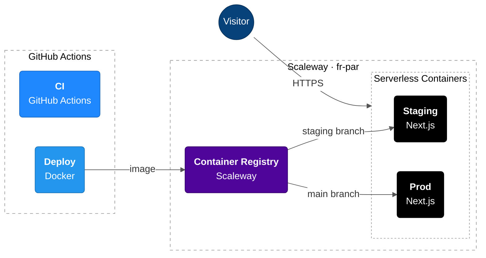

# Infrastructure

The site is a Next.js app (`output: "standalone"`) packaged as a Docker image and run on
Scaleway Serverless Containers, region `fr-par`.

## Environments

|                    | Staging                                                                         | Production                                                                   |
| ------------------ | ------------------------------------------------------------------------------- | ---------------------------------------------------------------------------- |
| Git branch         | `staging`                                                                       | `main`                                                                       |
| GitHub environment | `staging`                                                                       | `production`                                                                 |
| Config file        | [`deploy/staging.env`](../deploy/staging.env)                                   | [`deploy/production.env`](../deploy/production.env)                          |
| Container          | `foncier-plus-staging`                                                          | `foncier-plus-prod`                                                          |
| Default URL        | https://foncierplus21feb01d-foncier-plus-staging.functions.fnc.fr-par.scw.cloud | https://foncierplus21feb01d-foncier-plus-prod.functions.fnc.fr-par.scw.cloud |

## How a deploy works

1. A push to `staging` or `main` runs [`deploy_scaleway.yml`](../.github/workflows/deploy_scaleway.yml).
2. The workflow loads the matching `deploy/*.env` file and builds the image from the
   [`Dockerfile`](../Dockerfile). `ALLOW_INDEXING` is passed as a build argument, because pages
   are prerendered at build time.
3. The image is pushed to the Scaleway Container Registry, then the container is updated to
   that image and redeployed.

Each GitHub environment holds `SCW_ACCESS_KEY` and `SCW_SECRET_KEY` for its own Scaleway IAM
application (`foncier-plus-deploy-prod`, `focnier-plus-deploy-staging`). Both applications have
`ContainerRegistryFullAccess` and `ContainersFullAccess`.

## Notes

- **HTTPS only.** The containers redirect plain HTTP to HTTPS.
- **Caching and compression.** The Next.js server gzips responses and sends long cache headers
  for `/_next/static/*`. No CDN is needed at the current traffic level.
